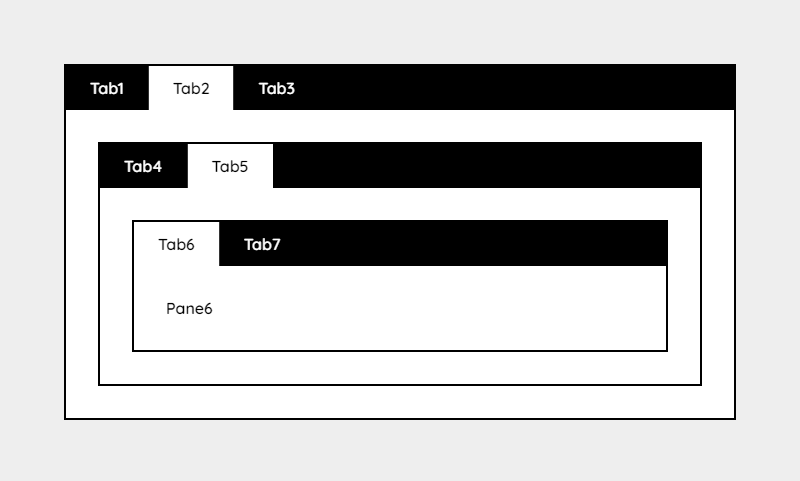

# Tabbis

*Version 3.0* - See the [Changelog](docs/CHANGELOG.md) or [version 1](old). If you like Tabbis, please considder [making a donation](https://www.paypal.me/DevoneraAB) to support my work.



**About**

Really simple tabs with pure vanilla javascript, no jQuery involved. It's just 3.3 kB minified and 1.2 kB gzipped.

- Supports old and new browsers - Has both ES5 and ES6 versions
- Supports unlimited nesting
- Supports keyboard navigation
- Supports accessability with automatic aria tags
- Supports options
- Supports custom events
- Supports memory using local storage (needs to be enabled in the options)

## Demos

- [Simple tabs](https://csspoo.com/tabbis/examples/simple.html)
- [Nested tabs with options](https://csspoo.com/tabbis/examples/style-default.html)

## Setup

```html
<!DOCTYPE html>
<html>
  <head>
    <meta charset="utf-8" />
    <meta name="viewport" content="width=device-width,initial-scale=1.0">
    <title>Tabbis</title>
    <link rel="stylesheet" href="../assets/css/dist/style-default.css">
  </head>
  <body>
    <div data-tabs>
      <button>Tab1</button>
      <button>Tab2</button>
      <button>Tab3</button>
    </div>

    <div data-panes>
      <div>Pane1</div>
      <div>Pane2</div>
      <div>Pane3</div>
    </div>

    <script src="../assets/js/dist/tabbis.es5.min.js"></script>
    <script>tabbis();</script>
  </body>
</html>
```

For more see the more advanced [examples](examples).

## Options

In the function call below, all the options are used. It will not change anything compared to `tabbis()`, because the default values are used in this case.

```js
tabbis({
  keyboardNavigation: true,
  memory: false,
  paneGroup: '[data-pane]',
  prefix: '',
  tabActive: '[data-active]',
  tabActiveFallback: 0,
  tabGroup: '[data-tabs]',
  trigger: 'click'
});
```

| Option               | Default           | Description                                                                                                                 |
| -------------------- | ----------------- | --------------------------------------------------------------------------------------------------------------------------- |
| `keyboardNavigation` | `true`            | Enable or disable keyboard navigation                                                                                       |
| `memory`             | `false`           | The local storage name. To disable memory you can set it to `false`. If you set `true` it will use `tabbis` as storage name |
| `paneGroup`          | `'[data-pane]'`   | A selector for Tabbis to know where your panes are located.                                                                 |
| `prefix`             | `''`              | By default Tabbis adds ids to the tabs and panes like `tab-0-0` and `pane-0-0`. In case of collision you can add a prefix.  |
| `tabActive`          | `'[data-active]'` | You can add `data-active` to the tab that you want to be active on first load.                                              |
| `tabActiveFallback`  | `0`               | If no tab is selected on load it will fall back to the first tab. To not select any tab on load set this to `false`         |
| `tabGroup`           | `'[data-tabs]'`   | A selector to know where your tabs are located.                                                                             |
| `trigger`            | `click`           | Change the tab trigger event to something like `mouseover`                                                                  |

## Custom event

Instead of a callback, Tabbis uses a custom event that is emitted when a tab is activated.

```js
document.addEventListener("tabbis", e => {
    let data = e.detail;
    console.log(data.tab);
    console.log(data.pane);
}, false );
```

## Keyboard navigation

Tabbis supports keyboard navigation.

- Arrow keys (left/right, up/down) - Will activate the next or previous tab to the current activated tab.
- Tab (left/right) - Will jump from the active tab to the related pane or the other way around.

## Memory

To make the browser remember your tabs state after a page refresh, you can add `memory: true` or `memory: 'my-storage-name'`. When set to `true` it will use `tabbis` as storage name.

## Accessability

Aria markup is good for accessability. It's also a great standardized way to have a relationship between the tabs and the panes. That way we don't need to reinvent the wheel.

Tabbis automatically adds aria attributes to the elements, so you don't have to.

## Active tab

There are many ways to have a tab activated.

### Interaction

When you click a tab or press enter on you keyboard, the current tab will be activated by default.

### Memory

In case you have set `memory: true`, Tabbis will remember the current state of your tabs after you refresh the page.

### Selector

By default you can add `data-active` as an attribute to the tab in a group that should be active. Tabbis will then automatically add `aria-selected="true"` on the active tab. If memory is enabled it will override this state from the memory.

### Aria attribute

It's not recommended because of flash of unstyled content, but it's now possible to add `aria-selected="true"` to the tab in a group that should be active, instead of using `data-active`. If memory is enabled it will override this state from the memory.

### Tab index

If you have not added `data-active` as an attribute to a tab, it will by default fallback to the first tab. You can force Tabbis to not select anything with `tabActiveFallback: false`.

## Requirements

Tabbis is tested with the following browsers.

- Chrome
- Edge
- Firefox
- Opera

*What about IE11? Help me out and try IE11 (with the ES5 version) and report the result as an issue.*

## FAQ

### Why does Tabbis not load?

In some cases you may need to wait for the dom to load. It can be done like below.

```js
window.addEventListener('DOMContentLoaded', () => {
  tabbis();
});
```

### How can I trigger a tab to activate?

There is no built in feature in Tabbis to do that, but it can be done with pure javascript.

```js
const element = document.querySelector('.my-tab');
element.click();
```

### How can I reset the tabs memory?

One way is to use the [Clear Session](https://chrome.google.com/webstore/detail/clear-session/maejjihldgmkjlfmgpgoebepjchengka) which is a Google Chrome extension.

### Why is the memory acting wierd when I use tabs on multiple pages?

The memory uses a key that is bound to a domain, not a page. You should change the `memory: 'tabbis'` to something like `memory: 'tabbis-page-about'` to have a unique memory for each page type.

## Disclaimer

This library is provided "as is" with no guarantee. Use it at your own risk and always test it yourself before using it in a production environment. If you find any issues, please create a new issue.

## Featured

- https://www.hongkiat.com/blog/50-nice-clean-css-tab-based-navigation-scripts/
- https://www.cssscript.com/tiny-nested-tabs-vanilla-javascript-tabbis-js/

## Inspiration

- https://github.com/cferdinandi/tabby
- https://developer.mozilla.org/en-US/docs/Web/Accessibility/ARIA/Roles/Tab_Role

## Credits

- [Jens Törnell](https://github.com/jenstornell)

## License

[MIT](LICENSE)