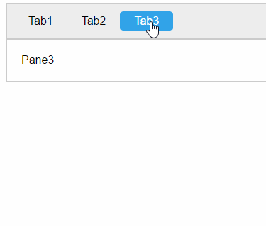

# Tabbis

***New version available*** - *Old version can be found <a href="https://github.com/jenstornell/tabbis.js/blob/master/old/demo.html">here</a>*.

Really simple tabs with pure vanilla javascript.

**Features**

- Tiny filesize
- Simple setup
- Remember tabs
- Callback support
- Unlimited tab sets
- Unlimited nesting

**Also**

- No jQuery
- No bloat
- No hash

**Preview**



## Install

Install by the simple OR the [advanced setup](advanced.md) depending on your needs.

### Simple setup

**Scripts:** Add this just before `</body>`:

```html
<script src="tabbis.js"></script>
<script>
  var tabs = tabbis.init();
</script>
```

**Stylesheet:** Add this before `</head>`:

```html
<link rel="stylesheet" href="css/tabby.css" />
```

**Html:** Add this somewhere after `<body>`:

```html
<div data-tabs>
  <div>Tab1</div>
  <div>Tab2</div>
  <div>Tab3</div>
</div>

<div data-panes>
  <div>Pane1</div>
  <div>Pane2</div>
  <div>Pane3</div>
</div>
```

**[Advanced setup](docs/advanced.md)**

## Memory

By design, when using the tabs they are save in your localStorage. If you reset the browser the tabs will still be open where you left them.

## Requirements

A modern browser.

**Tested with:**

- Chrome
- Firefox
- Edge

## Disclaimer

This plugin is provided "as is" with no guarantee. Use it at your own risk and always test it yourself before using it in a production environment. If you find any issues, please create a new issue.

## License - MIT

https://opensource.org/licenses/MIT

## Featured

- https://www.hongkiat.com/blog/50-nice-clean-css-tab-based-navigation-scripts/
- https://www.cssscript.com/tiny-nested-tabs-vanilla-javascript-tabbis-js/

## Credits

- [Jens Törnell](https://github.com/jenstornell)
