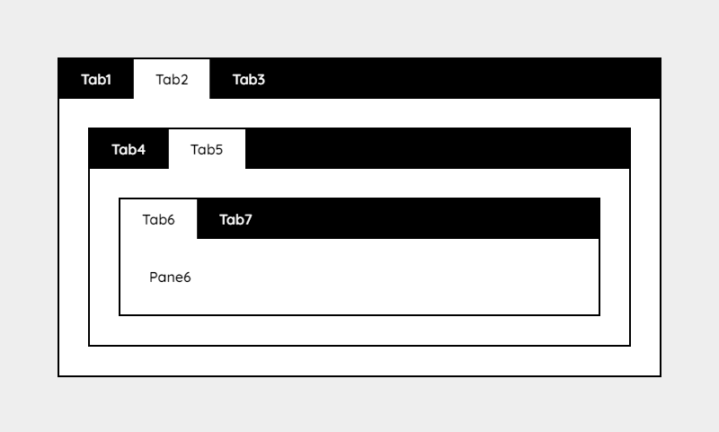

# Tabbis

*Version 2.0 - For version 1 go to [old](old).*

Really simple tabs with pure vanilla javascript.

**Supports**

- Nesting
- Memory
- Options
- Callback

**Also**

- No jQuery
- No bloat
- No hash

**Preview**



## Demos

- [Demo 1 - Simple tabs](https://csspoo.com/tabbis/example-simple.html)
- [Demo 2 - Nested tabs](https://csspoo.com/tabbis/example-nested.html)
- [Demo 3 - Nested tabs with options](https://csspoo.com/tabbis/example-nested-with-options.html)

## Examples

- [Example 1 - Simple tabs](example-simple.html)
- [Example 2 - Nested tabs](example-nested.html)
- [Example 3 - Nested tabs with options](example-nested-with-options.html)

## Install

### Stylesheet

Add this before `</head>`:

```html
<link rel="stylesheet" href="assets/css/dist/tabbis.min.css">
```

*This stylesheet only includes the minimum required style for the tabs to work. For something more visual, include `demo.css` as well.*

### Html

Add this somewhere after `<body>`:

```html
<div data-tabs>
  <div>Tab1</div>
  <div>Tab2</div>
  <div>Tab3</div>
</div>

<div data-panes>
  <div>Pane1</div>
  <div>Pane2</div>
  <div>Pane3</div>
</div>
```

### Scripts

Add this before `</body>`:

```html
<script src="assets/js/dist/tabbis.min.js"></script>
<script>tabbis();</script>
```

## Options

If you need to use the options the script part will look like below.

```js
tabbis({
  tab: {
    group: '[data-tabs]',
    activeData: '[data-active]',
    activeClass: 'active'
  },
  pane: {
    group: '[data-panes]',
    activeClass: 'active'
  },
  memory: 'tabbis', // Set to false to disable
  callback: function(tab, pane) {
    console.log(tab);
    console.log(pane);
  }
});
```

*The options are **nested** like the example, but in the table dot notation is used to make it more readable.*

| Option | Default   | Description |
| ------ | --------- | ----------- |
| `tab.group`        | `[data-tabs]`   | A selector to know where your tabs are located. |
| `tab.activeData`   | `[data-active]` | You can add `data-active` to the tab that you want to be active on first load. |
| `tab.activeClass`  | `active`        | The current tab class that will be added when the user clicks a tab. |
| `pane.group`       | `[data-pane]`   | A selector for Tabbis to know where your panes are located. |
| `pane.activeClass` | `active`        | The current pane class that will be added when user clicks a tab. |
| `memory`           | `tabbis`        | The local storage name. To disable memory you can set it to `false`. |
| `callback`         | `null`          | To do something when a tab is clicked you can use the callback. See example. |


## Memory

By design, when using the tabs, they are save in your local storage. If you reset the browser, the tabs will still be open where you left them. To disable memory you can set `memory: false` in your options.

## Set active tab

If you have memory activated, Tabbis will look there first and set a tab to active from there.

**If memory is not activated or set:**

- If you set `data-active` to a tab, it will be active.
- If you don't set any tab to active, the first tab and the first pane will be active.

*Don't add `active` class on a tab directly. It may cause a flash of unstyled content. Instead use `data-active`.*

## Nesting

It's possible to have nested tabs. See [example-nested.html](example-nested.html).

## Requirements

A modern browser.

**Tested with:**

- Chrome
- Firefox
- Edge

## FAQ

### Why does tabbis does not load?

In some cases you may need to wait for the dom to load.

```js
window.addEventListener('DOMContentLoaded', () => {
    tabbis();
});
```

### How can I trigger a tab do activate?

There is no built in feature in Tabbis to do that but it can be done with pure javascript.

```js
const element = document.querySelector('.my-tab');
element.click();
```

### How can I reset the tabs memory?

One way is to use the [Clear Session](https://chrome.google.com/webstore/detail/clear-session/maejjihldgmkjlfmgpgoebepjchengka) which is a Google Chrome extension.

### Why is the memory acting wierd when I use tabs on multiple pages?

The memory uses a key that is bound to a domain, not a page. You should change the `memory: 'tabbis'` to something like `memory: 'tabbis-page-about'` to have a unique memory for each page type.

## Disclaimer

This library is provided "as is" with no guarantee. Use it at your own risk and always test it yourself before using it in a production environment. If you find any issues, please create a new issue.

## License - MIT

https://opensource.org/licenses/MIT

## Featured

- https://www.hongkiat.com/blog/50-nice-clean-css-tab-based-navigation-scripts/
- https://www.cssscript.com/tiny-nested-tabs-vanilla-javascript-tabbis-js/

## Credits

- [Jens Törnell](https://github.com/jenstornell)
